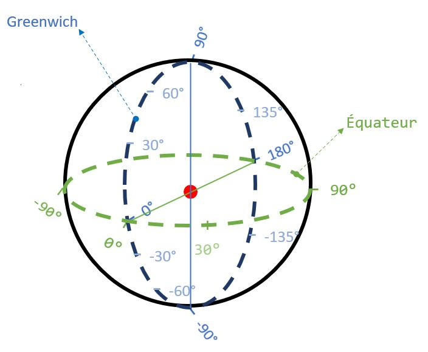

# Exercice 6

Dans l’optique de développer une app pour smartphone permettant de localiser le DEA (Défibrillateur Externe Automatisé) le plus proche de vous et ainsi de peut-être sauver des vies, nous allons développer un prototype permettant de tester l’idée. Dans la problématique, il est nécessaire de pouvoir calculer la distance entre deux points du globe. Ecrivez en C un programme permettant de calculer une distance à partir de coordonnées GPS. Pour l’exercice, utilisez les formules suivantes :

```math
x = (longitudeB - longitudeA) \times \cos \left(\frac{latitudeA + latitudeB}{2} \right)
```

```math
y = latitudeB - latitudeA
```

```math
d = \sqrt{x^2 + y^2} \times 6371
```



**Notes :**
1) Dans cette formule, les latitudes et longitudes sont exprimées en radians.
1) L'utilisateur encondera les angles de latitudes et longitudes en degrés (comme c'est le cas conventionnellement).
1) Rappelons-nous que 180° = π radians !
1) En C, en ajoutant #include <math.h> en début de programme, on a droit à M_PI qui est la constante π (avec une précision suffisante)
1) La formule donne la distance en km entre les 2 points.
1) Les calculs peuvent être vérifiés facilement avec Google Maps ou bien avec les valeurs tests suivantes :<br />
    latA = 50.661778<br />
    longA = 5.523157<br />
    latB = 49.000968<br />
    longB = 3.413383<br />
    -> latA (rad) = 0.884215<br />
    -> longA (rad) = 0.096397<br />
    -> latB (rad) = 0.855228<br />
    -> longB (rad) = 0.059575<br />
    -> x = -0.023752<br />
    -> y = -0.028987<br />
    -> d = 238.753505 (km);
